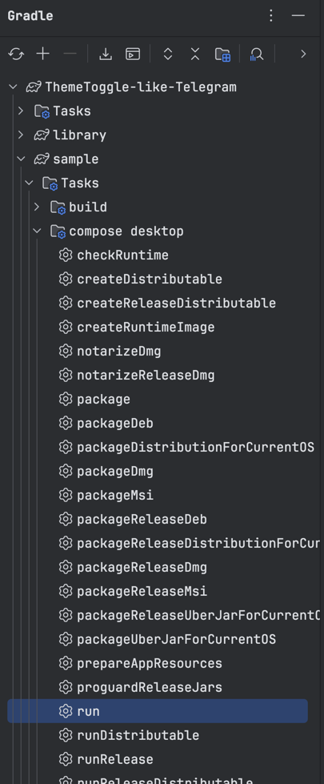

[English](./README.md) | [中文](./doc/README.zh-CN.md)

# ThemeToggle-like-Telegram

A simple theme toggle like Telegram using `Compose for Desktop` & `Kotlin`.

Telegram's animations have always been excellent on any platform, and I liked it's animation of
transitions when toggle light/dark theme.

I have implemented it on Android before, and I happened to be learning about Compose for Desktop
recently, so I decided to replicate it.

# Preview


# Getting Started

1. Clone the repository

   run this command

   ```sh
   git clone https://github.com/MultiWolf/ThemeToggle-like-Telegram.git
   ```

2. Open the project in your IDE

   Open the project in your favorite IDE, I recommend using IntelliJ IDEA.

3. Try it out

   Run the project using

   ```sh
   ./gradlew :run
   ```

   If you are not a CLI person, you can run it from Gradle Tool window

   

# How it works

In face, no magic here, it's easy to understand.

Have you ever played or seen scratch cards? You scratch the card to reveal the hidden content.

So, in this project,
look [ToggleEffectBox.kt](https://github.com/MultiWolf/ThemeToggle-like-Telegram/blob/main/src/main/kotlin/com/fleey/toggle/ToggleEffectBox.kt)
file, this hides the magic behind it.

I use `Canvas` to draw the content, and I use `ClipPath` to clip the content.

When the user clicks on the toggle:

- Use `captureScreenAsImage()` function to capture the window as an image.
- Start an animation (which is non-linear) that assists the `ClipPath` with a dynamic value
  of `animProgress` to calculate its' `radius`.
- Draw the `ClipPath` with the calculated `radius` to clip the content.
- Draw the captured image on the `Canvas` to reveal the hidden content.
- Repeat the process when the user clicks on the toggle again (but it'll change the animation
  direction based on `isDark`).

so, it's simple, right :)? Hope you enjoy it, and feel free to ask me anything.

If you have any suggestions or improvements, please let me know.

And if you like it, please give it a star ⭐️, Thank you ❤️.

# License
-------

    Copyright (c) 2024-present. Fleey

    Licensed under the Apache License, Version 2.0 (the "License");
    you may not use this file except in compliance with the License.
    You may obtain a copy of the License at

       http://www.apache.org/licenses/LICENSE-2.0

    Unless required by applicable law or agreed to in writing, software
    distributed under the License is distributed on an "AS IS" BASIS,
    WITHOUT WARRANTIES OR CONDITIONS OF ANY KIND, either express or implied.
    See the License for the specific language governing permissions and
    limitations under the License.