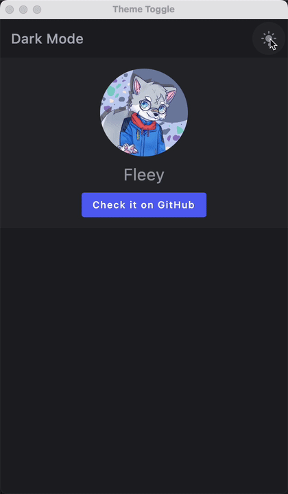
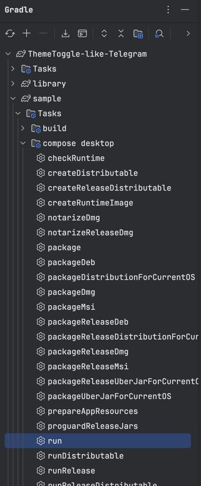

[English](../README.md) | [中文](./doc/README.zh-CN.md)

# ThemeToggle-like-Telegram

使用 `Compose for Desktop` 和 `Kotlin` 实现的类似 Telegram 的简单主题切换功能。

Telegram 在任何平台上的动画一直都非常出色，我特别喜欢它在切换浅暗主题时的过渡动画。

我之前已经在 Android 上实现过它，恰巧最近在学习 Compose for Desktop，所以决定复刻一下。

# 截图



# 起步

1. 克隆仓库

   运行本指令：

   ```sh
   git clone https://github.com/MultiWolf/ThemeToggle-like-Telegram.git
   ```

2. 在你喜欢的 IDE 中启航

   我推荐使用 IntelliJ IDEA。

3. 尝试运行

   使用以下命令运行项目：

   ```sh
   ./gradlew :run
   ```

   如果您不习惯使用命令行界面，您也可以从 Gradle 工具窗口运行。

   

# 原理

事实上，没有魔法，其实很容易理解。

您是否曾经玩过或见过刮刮卡，刮开卡片以显示隐藏的内容。

查看 [ToggleEffectBox.kt](https://github.com/MultiWolf/ThemeToggle-like-Telegram/blob/main/com/fleey/toggle/ToggleEffectBox.kt)
文件，这里隐藏了背后的秘密。

我使用 Canvas 来绘制内容，并使用 ClipPath 来剪切内容。

当用户点击切换时：

- 使用 `captureScreenAsImage()` 函数捕获窗口为图像。

- 启动一个非线性的动画，该动画协助 `ClipPath` 根据动态值 `animProgress` 计算其 `radius`。

- 使用计算出的 `radius` 绘制 `ClipPath` 以剪切内容。

- 在 `Canvas` 上绘制捕获的图像以显示隐藏的内容。

- 当用户再次点击切换时重复此过程（但它会根据 `isDark` 更改动画方向）。

so，这很简单，对吧 :)？希望您喜欢它，如果有任何问题，请随时向我咨询。

如果您有任何建议或改进，请告诉我。

如果您喜欢它，请给它一个星标 ⭐️，谢谢您 ❤️。

# License
-------

    Copyright (c) 2024-present. Fleey

    Licensed under the Apache License, Version 2.0 (the "License");
    you may not use this file except in compliance with the License.
    You may obtain a copy of the License at

       http://www.apache.org/licenses/LICENSE-2.0

    Unless required by applicable law or agreed to in writing, software
    distributed under the License is distributed on an "AS IS" BASIS,
    WITHOUT WARRANTIES OR CONDITIONS OF ANY KIND, either express or implied.
    See the License for the specific language governing permissions and
    limitations under the License.